# TechLabs-project

### 지원자 성명
* **이명학**
----
### 개발 환경
* **IDE**: IntelliJ
* **Language**: Java 11
* **Framework**: Spring boot 3.1.4
----
### 빌드 방법
* **Gradle**
* **Jar**
----
### 과제 수행 내역
1. **상품 정보 및 연관 상품에 대한 조회**
- 입력 파라미터 (URL Query Parameter)
    - id: 결과로 볼 상품코드
    - 2개 이상의 상품을 볼 경우 콤마(,)로 구분. ex: id=1,2,3
- 결과
    - JSON 형태의 결과
    - 입력 상품과 결과 상품을 상품 정보와 조합하여 반환한다. 
### **1-1 수행 내역(Description)**   
     
  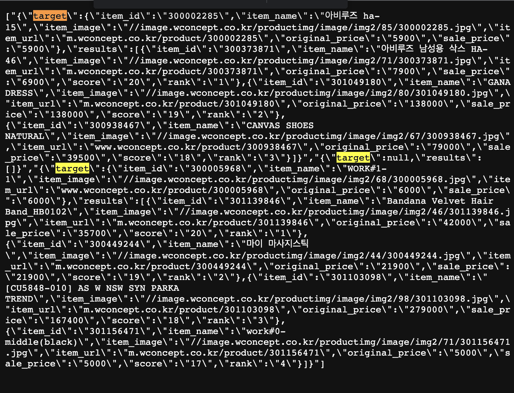

```java
1. Get 요청방식으로 구현했고, Parameter에 입력한 id값을 기준으로 csv파일을 탐색하도록 코드를 작성했습니다.
2. 2개 이상의 상품을 볼 경우 콤마로 구분되며, 반복문을 통해 각각의 id값을 탐색합니다.
3. 컴포넌트로 구현한 readCsv함수를 통해 각 엑셀 데이터를 저장합니다.
4. for문을 통해 요청한 item_id에 해당하는 값을 DTO에 저장합니다. product.csv는 단건 데이터이기에 한 번의 반복문을 사용했고, rec.csv는 다건 데이터이기 때문에 2중 반복문을 사용했습니다.
5. 저장한 DTO를 JSON 형식으로 반환합니다.
```
----------
2. **상품 정보 및 연관 상품 정보에 대한 입력/수정/삭제 기능**

- 상품 정보(product)와 연관 상품 정보(rec)에 대한 Insert/Update/Delete 기능.
- 해당 기능에 대한 정확한 가이드는 없으며, 지원자가 생각하기에 적합한 방식으로 구현.
- 구현한 기능을 사용하기 위한 가이드를 README.md 파일에 간단한 설명 추가.

- **수행 내역(Description)**


### 2-1. **Insert 기능**

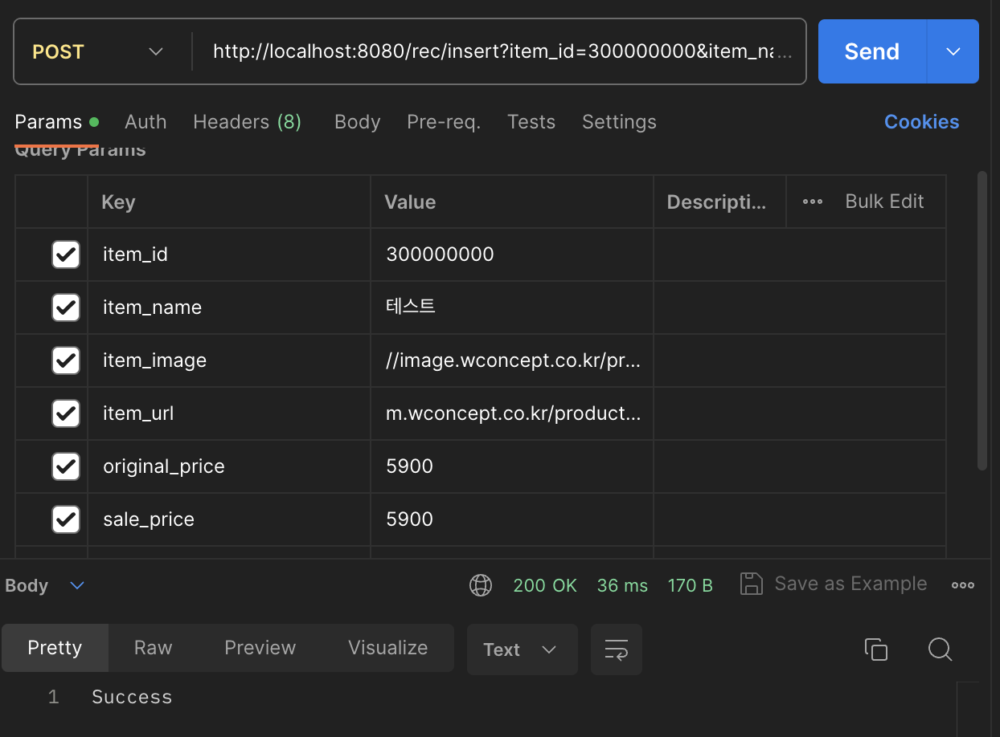
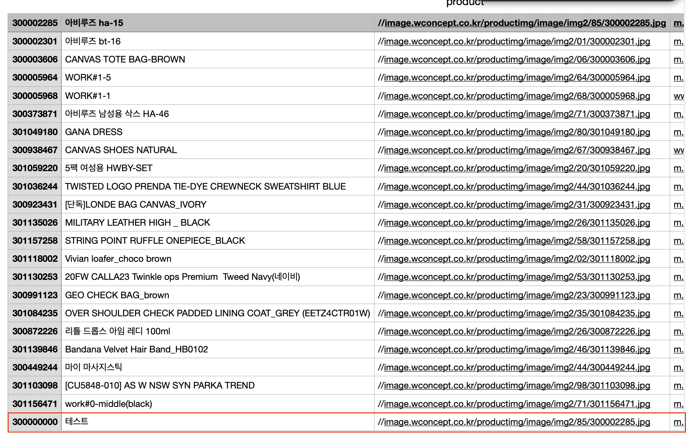
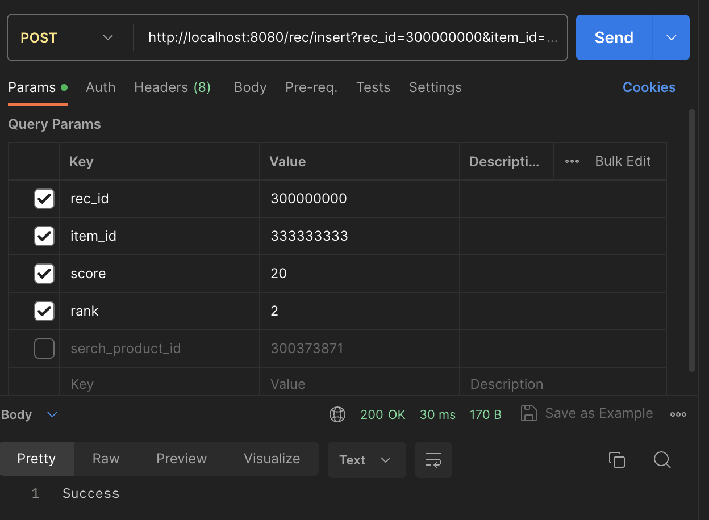
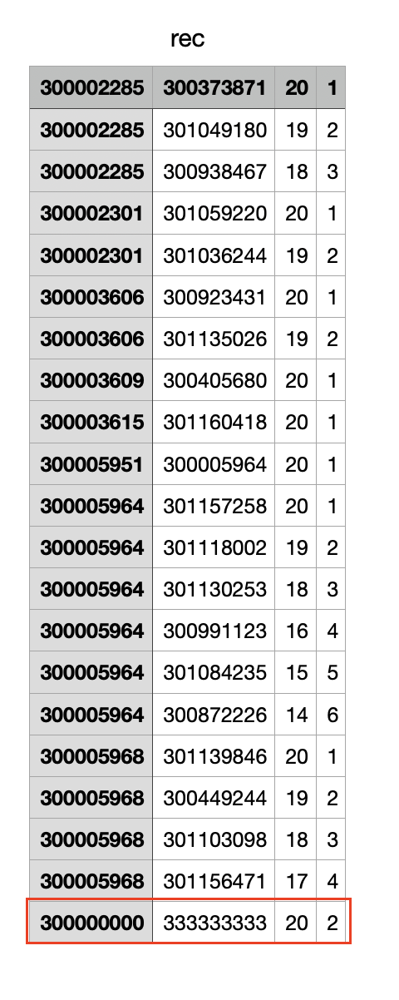

   ```java
   1. rec/inset 앤드포인트로 Post요청을 보내면 요청의 parameter에 담긴 값들이 엑셀에 Insert 되게끔 구현했습니다.
   2. 이미지와 같이 삽입할 데이터의 item_id, item_name, item_image, item_url, original_price, sale_price를 입력합니다.
   ```
### 2-2. **Update 기능**  

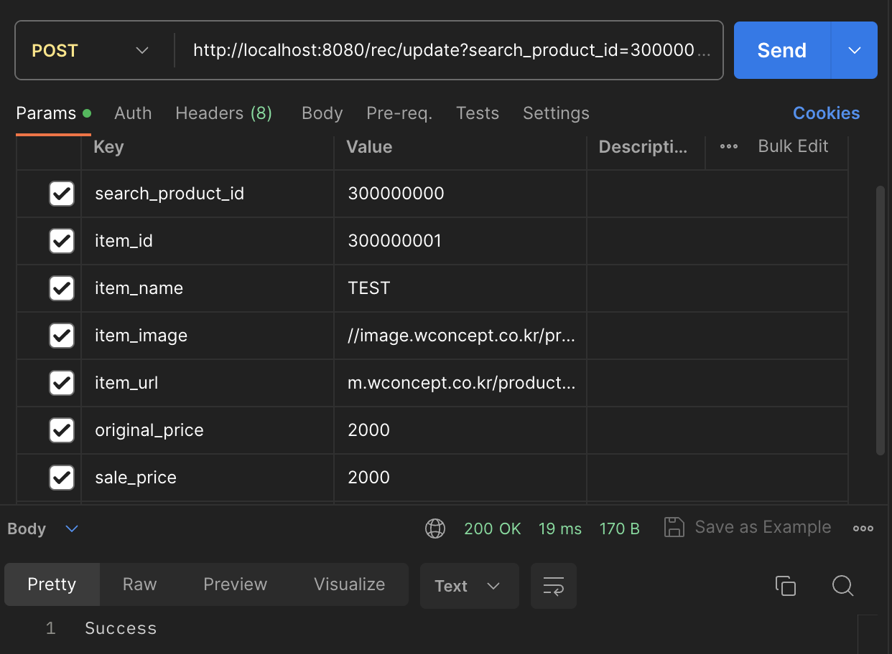
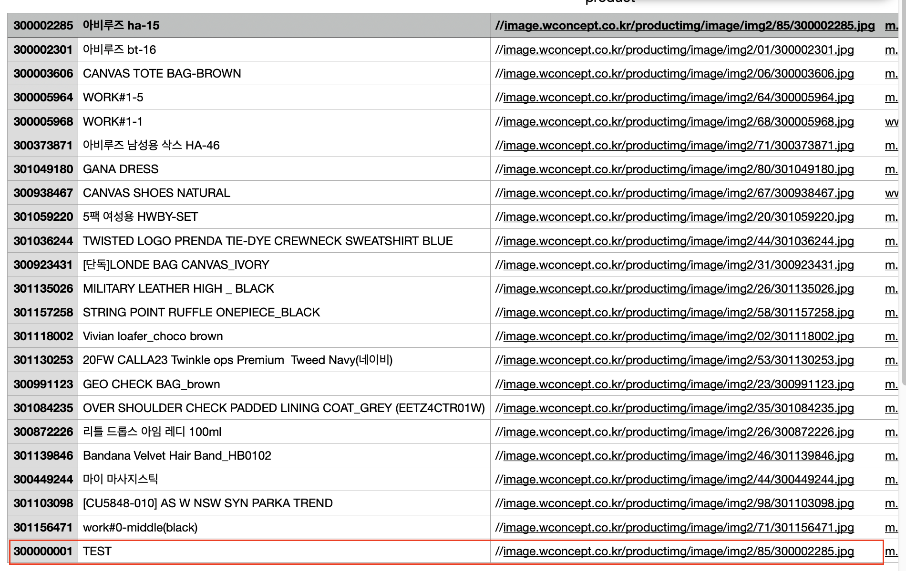
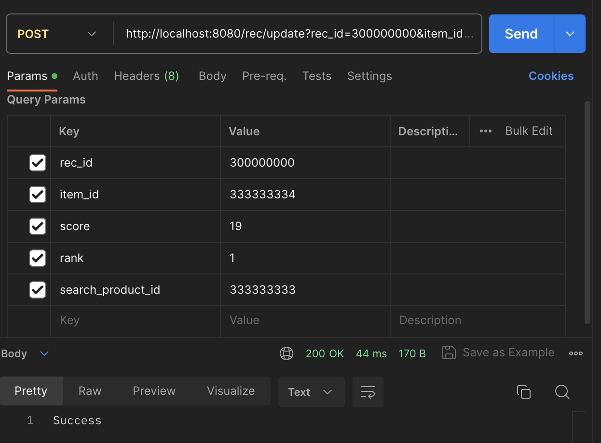
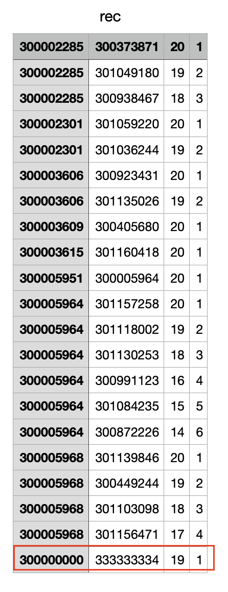

```java
  1. rec/update 앤드포인트로 Post요청을 보내면 요청의 parameter에 담긴 값들이 엑셀에 Update 되게끔 구현했습니다.
  2. Update기능은 update하고 싶은 search_product_id를 입력해야 합니다.
  3. parameter의 갯수가 7개라면 product.csv를 탐색하도록, 5개라면 rec.csv를 탐색하도록 구현했습니다.
  4. 입력한 search_product_id를 기반으로 엑셀을 탐색하며 관리자가 입력한 값들로 update합니다.
  ```
### 2-3. **Delete 기능**

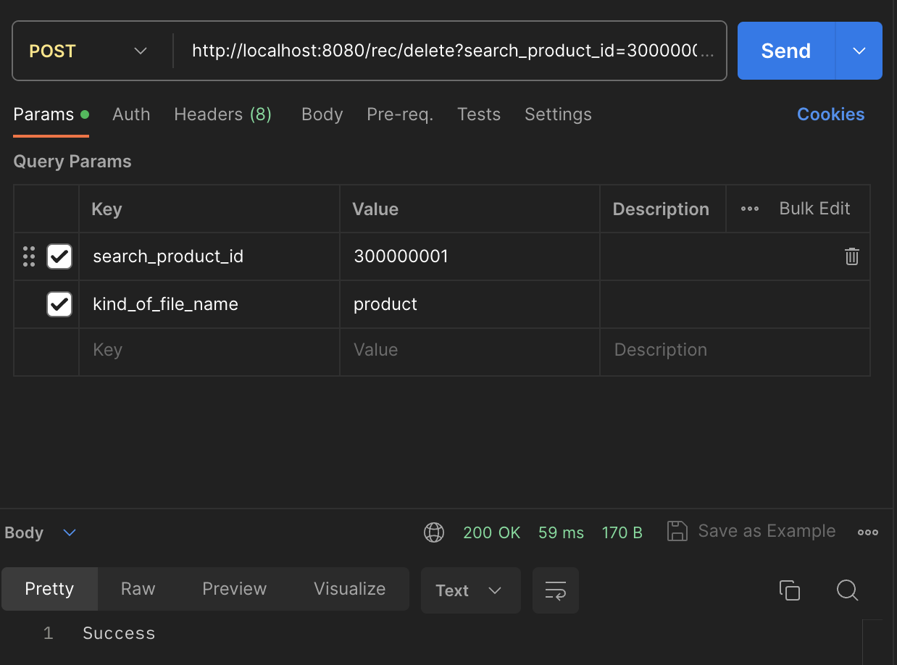
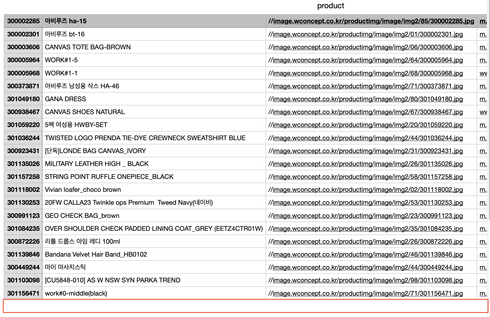
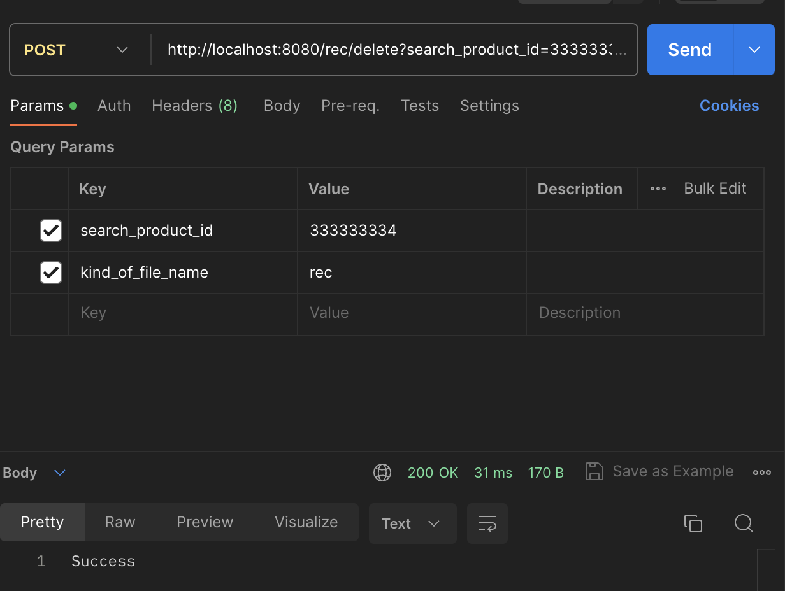
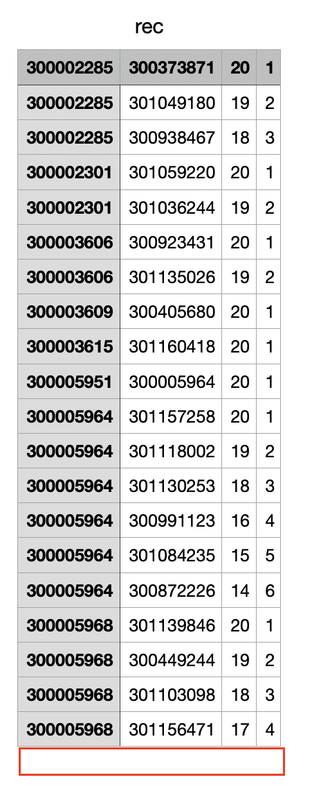

```java
  1. 데이터를 삭제하기 위해선 rec/delete 앤드포인트로 Post요청을 보내야 합니다. 
  2. kind_of_file_name에 값에 따라 탐색하는 엑셀이 구분되며, search_product_id값을 탐색하여 일치하는 값의 데이터를 삭제합니다.
 ```
---
### 개발 중 고려한 사항 및 확인 시 참고할 사항
* item_id는 고유한 id값이라고 가정하고 1번과 2번 코드를 구현했습니다.
* 2번 기능의 경우 관리자가 사용하는 기능이라고 가정하고 구현했습니다.
* 2번 기능의 경우 Insert, Update는 단 건 요청에 한 개의 데이터가 삽입되며 Delete에 경우에는 한 번 요청의 해당되는 값 여러개가 삭제됩니다.
* 탐색하는 csv파일의 경로는 local 경로로 지정하였습니다.

----
